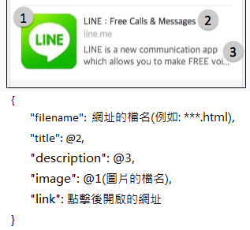

# RichLinkPreviewMiddler
- Generate HTML as a middler character for `link preview` between the providers(like Line, Facebook...) and the redirecting site.
- These HTMLs with rich meta-datas in the `<head>` will redirect to the link where you wish to go, and the rich meta-datas will be crawled by the providers, and show the `link preview`.
- There is a [Demo](https://github.com/ChaoLiou/RichLinkPreviewMiddlerDemo) repo for this.

## How to work
- You need to fill in the `structure.json`, and execute the `RichLinkPreviewMiddler.exe`.

